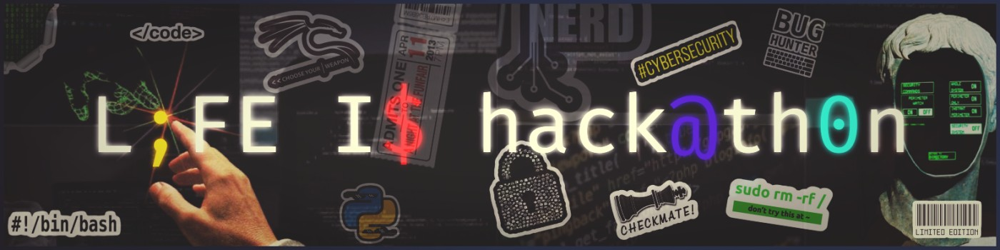
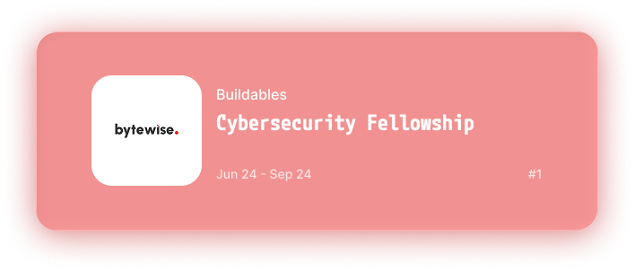
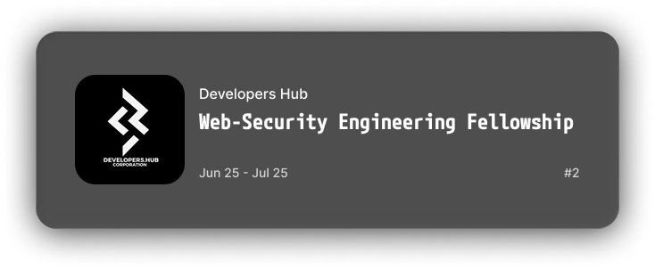

<!-- markdownlint-disable MD033 -->

<p align="center">

<a href="https://github.com/atharimran728" target="_self">
  
</a>

</p> 

<div align="center">

<h1>👾 Threat detected? Nope, just me — <a href="https://atharimran728.lovable.app/" target="_self">  </a> </h1>

<h3>🔒 SOC Analyst | Cybersecurity | Blue Team </h3>

<blockquote> <p><em>Every packet tells a story; here’s mine.</em></p> </blockquote>

</div> 

---
### 📡 Reach Me
<h5 align="center">
  <code><a href="https://www.linkedin.com/in/atharimran728/" title="LinkedIn Profile"> LinkedIn</a></code>
  <code><a href="atharimran728@gmail.com" title="Gmail"> Gmail</a></code>
  <code><a href="https://atharimran728.lovable.app" title="Portfolio"> Portfolio</a></code>
  <code><a href="https://www.instagram.com/atharimran728/" title="Instagram Profile"> Instagram</a></code>
  <code><a href="https://www.pinterest.com/atharimran728/" title="Pintrest Profile"> Pintrest</a></code>
</h5>

---

```diff
+> whoami
@@ atharimran728:~$ id @@

👤  Name:        Athar Imran  
💼  Role:        Security Analyst   
🌐  Location:    Pakistan  
📡  Status:      youngblooded and firehearted 

Cybersecurity student and SOC Analyst-in-training passionate about threat detection, incident response, and adversary emulation.  

My journey began with a simple question —“How does this work?” — and evolved into a mission to understand how attackers think so I can stop them.

````

---

## 🧪 Experience
> `Telemetry feed: internships logged.`  

<p align="left">
  <a href="https://www.linkedin.com/in/atharimran728/details/experience/" target="_blank">
    
  </a>

  <a href="https://www.linkedin.com/in/atharimran728/details/experience/" target="_blank">
    
  </a>
</p>

<p align="left">
  <a href="https://www.linkedin.com/in/atharimran728/details/experience/" target="_blank">
    
  </a>
</p>

---

## 📂 Top Repositories
> `Querying top GitHub assets...`

<p align="center">
  <a href="https://github.com/atharimran728/Insider-Threat-s-Lateral-Movement-Simulation-Detection-Identification-using-NetworkMiner3.0-Zeek" target="_blank">
    
  </a>
  <a href="https://github.com/atharimran728/Snort-IDS-IPS-Detection-and-Evasion" target="_blank">
    
  </a>
  <a href="https://github.com/atharimran728/Deployment-and-Integration-of-Wazuh-SIEM" target="_blank">
    
  </a>
</p>

---

## 🎓 Certifications
> `Validating credentials...`

<p align="center">
    
    
    
    
    
    
    
    
    
    

</p>

---

## ⚙️ Skills
> `Parsing capability matrix...`

### 🧩 Tools

<h5 align="center">
  <code><br> Wazuh</code>
  <code><br>ELK Stack</code>
  <code><br>OSSEC</code>
  <code> <br>SNORT</code>
  <code><br> Fail2Ban</code>
  <code><br>Wireshark</code>
  <code><br>NetworkMiner</code>
  <code><br>Zeek</code>
  <code><br>Suricata</code>
  <code><br>AtomicRedTeam</code>
  <code><br>Caldera</code>
</h5>

### 💻 Languages

<div align="center">
  <table>
    <tr>
      <td align="center" style="padding: 10px;">
        <br>
        <sub><b>Python</b></sub>
      </td>
      <td align="center" style="padding: 10px;">
        <br>
        <sub><b>C++</b></sub>
      </td>
      <td align="center" style="padding: 10px;">
        <br>
        <sub><b>Bash</b></sub>
      </td>
      <td align="center" style="padding: 10px;">
        <br>
        <sub><b>YAML</b></sub>
      </td>
      <td align="center" style="padding: 10px;">
        <br>
        <sub><b>Regex</b></sub>
      </td>
      </td>
    </tr>
  </table>
</div>

### 🧠 What I Do


 


---

## 🎯 Outside the SOC
<div align="center">


</div>


---
